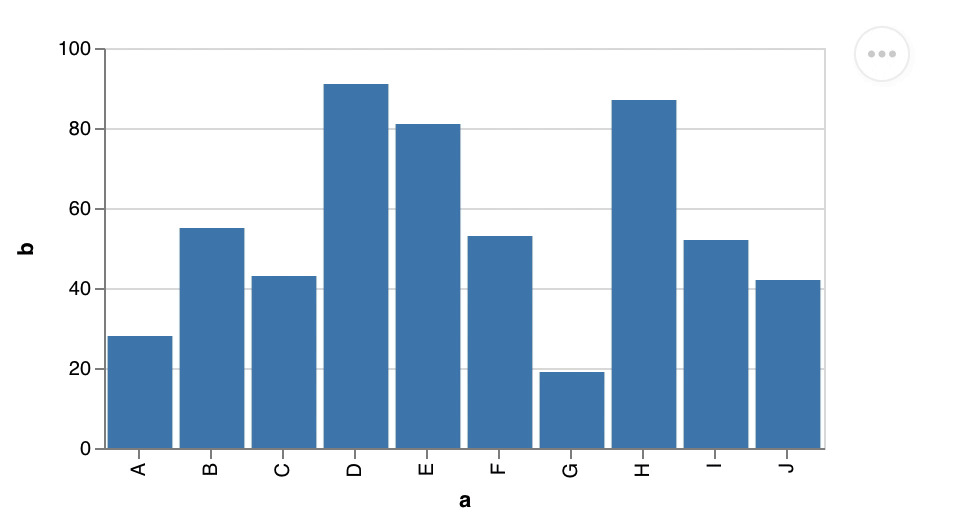

# Vega-Embed

[](https://www.npmjs.com/package/vega-embed) [](https://www.jsdelivr.com/package/npm/vega-embed) [](https://github.com/vega/vega-embed/actions) [](https://codecov.io/gh/vega/vega-embed) [](https://github.com/prettier/prettier)

[Vega-Embed](http://github.com/vega/vega-embed) makes it easy to embed interactive [Vega](https://vega.github.io/vega) and [Vega-Lite](https://vega.github.io/vega-lite) views into web pages. With Vega Embed, you can:

- Load Vega/Vega-Lite specs from source text, parsed JSON, or URLs.
- Patch Vega specs (even ones generated from Vega-Lite) to add additional functionality; for example, see [Rotating Earth](https://observablehq.com/@domoritz/rotating-earth).
- Add action links such as "View Source" and "Open in Vega Editor".
- Includes [Vega Tooltip](https://github.com/vega/vega-tooltip).
- Includes [Vega Themes](https://github.com/vega/vega-themes). **Experimental: themes are not stable yet**

**Vega-Lite works well with [Observable](https://beta.observablehq.com/). Learn how to use it in [our example notebook](https://beta.observablehq.com/@domoritz/hello-vega-embed).**



## Basic Examples

### Directly in the Browser

You can import Vega-Embed from a local copy or (as shown below) [from jsDelivr](https://www.jsdelivr.com/package/npm/vega-embed). Please replace `[VERSION]` with the correct [Vega](https://www.jsdelivr.com/package/npm/vega), [Vega-Lite](https://www.jsdelivr.com/package/npm/vega-lite), and [Vega-Embed](https://www.jsdelivr.com/package/npm/vega-embed) versions. We recommend that you specify the major versions (`vega@5`, `vega-lite@5`, `vega-embed@6`).

```html
<!DOCTYPE html>
<html>
  <head>
    <!-- Import Vega & Vega-Lite (does not have to be from CDN) -->
    <script src="https://cdn.jsdelivr.net/npm/vega@[VERSION]"></script>
    <script src="https://cdn.jsdelivr.net/npm/vega-lite@[VERSION]"></script>
    <!-- Import vega-embed -->
    <script src="https://cdn.jsdelivr.net/npm/vega-embed@[VERSION]"></script>
  </head>
  <body>
    <div id="vis"></div>

    <script type="text/javascript">
      var spec = 'https://raw.githubusercontent.com/vega/vega/master/docs/examples/bar-chart.vg.json';
      vegaEmbed('#vis', spec)
        .then(function (result) {
          // Access the Vega view instance (https://vega.github.io/vega/docs/api/view/) as result.view
        })
        .catch(console.error);
    </script>
  </body>
</html>
```

### JavaScript or TypeScript

The basic example below needs to be transpiled and bundled (using rollup, webpack, etc..) before it can be loaded in a browser.

```ts
import embed from 'vega-embed';

const spec = {
  ...
}

const result = await embed('#vis', spec);

console.log(result.view);
```

### In Observable

You can require embed with `embed = require('vega-embed@6')` and then embed a chart with `viewof view = embed(...)`. Check the [our example notebook](https://beta.observablehq.com/@domoritz/hello-vega-embed) for more details.

## API Reference

When using a `script` tag, the default export of Vega-Embed is a wrapper function that automatically chooses between [`embed`](#embed) and [`container`](#container) based on the provided arguments. Vega-Embed provides this convenience for imports in interactive environments like [Observable](https://www.observablehq.com/). When using the Vega-Embed npm package, the default export is the [`embed`](#embed) function.

<a href="#embed" name="embed">#</a> <b>embed</b>(<i>el</i>, <i>spec</i>[, <i>opt</i>]) [<>](https://github.com/vega/vega-embed/blob/master/src/embed.ts 'Source')

Returns a [Promise](https://developer.mozilla.org/en-US/docs/Web/JavaScript/Reference/Global_Objects/Promise) that resolves to a result object. The result object contains:

| Property | Type | Description |
| :-- | :-- | :-- |
| `view` | String | The instantiated [Vega `View` instance](https://github.com/vega/vega-view#vega-view). |
| `spec` | Object | A copy of the parsed JSON Vega or Vega-Lite spec. |
| `vgSpec` | Object | The compiled Vega spec. |
| `finalize` | Function | A method to prepare embed to be removed. To prevent unwanted behaviors and memory leaks, this method unregisters any timers and removes any event listeners the visualization has registered on external DOM elements. Applications should invoke this method when a Embed or the View instance is no longer needed. This method calls [`view.finalize`](https://vega.github.io/vega/docs/api/view/#view_finalize). |

The `embed` function accepts the following arguments:

| Property | Type | Description |
| :-- | :-- | :-- |
| `el` | String | A DOM element or CSS selector indicating the element on the page in which to add the embedded view. |
| `spec` | String / Object | _String_ : A URL string from which to load the Vega specification. This URL will be subject to standard browser security restrictions. Typically this URL will point to a file on the same host and port number as the web page itself. <br> _Object_ : The Vega/Vega-Lite specification as a parsed JSON object. |
| `opt` | Object | _(Optional)_ A JavaScript object containing options for embedding. |

_Note: Internet Explorer does not support [the ES6 Promise](https://developer.mozilla.org/en-US/docs/Web/JavaScript/Reference/Global_Objects/Promise) feature. To make it work correctly, please follow [the instructions on the Vega website](https://vega.github.io/vega/usage/#ie)._

<a href="#container" name="container">#</a> <b>container</b>(<i>spec</i>[, <i>opt</i>]) [<>](https://github.com/vega/vega-embed/blob/master/src/container.ts 'Source')

Returns a [Promise](https://developer.mozilla.org/en-US/docs/Web/JavaScript/Reference/Global_Objects/Promise)\* that resolves to an HTML element with the [Vega `View` instance](https://github.com/vega/vega-view#vega-view) as the `value` property. The function is designed to work with [Observable](https://observablehq.com/). The `container` function accepts the following arguments:

| Property | Type | Description |
| :-- | :-- | :-- |
| `spec` | String / Object | _String_ : A URL string from which to load the Vega specification. This URL will be subject to standard browser security restrictions. Typically this URL will point to a file on the same host and port number as the web page itself. <br> _Object_ : The Vega/Vega-Lite specification as a parsed JSON object. |
| `opt` | Object | _(Optional)_ A JavaScript object containing options for embedding. |

### Options

You can configure Vega Embed with an options object. You can pass options as an argument to the [embed function](#api-reference) or as `usermeta.embedOptions` as part of the Vega or Vega-Lite specification.

```js
var opt = {
  mode: ...,

  config: ...,
  theme: ...,

  defaultStyle: ...,

  bind: ...,

  // view config options
  renderer: ...,
  loader: ...,
  logger: ...,
  logLevel: ...,

  tooltip: ...,

  patch: ...,

  width: ...,
  height: ...,
  padding: ...,

  actions: {
    export: ...,
    source: ...,
    compiled: ...,
    editor: ...
  },

  scaleFactor: ...,

  editorUrl: ...,

  sourceHeader: ...,
  sourceFooter: ...,

  hover: {
    hoverSet: ...,
    updateSet: ...,
  },

  downloadFileName: ...,

  formatLocale: ...,
  timeFormatLocale: ...,
  expressionFunctions: ...,

  ast: ...,
  expr: ...,

  i18n: {
    COMPILED_ACTION: ...,
    EDITOR_ACTION: ...,
    PNG_ACTION: ...,
    SOURCE_ACTION: ...,
    SVG_ACTION: ...
  }
}
```

| Property | Type | Description |
| :-- | :-- | :-- |
| `mode` | String | If specified, tells Vega-Embed to parse the spec as `vega` or `vega-lite`. Vega-Embed will parse the [`$schema` url](https://github.com/vega/schema) if the mode is not specified. Vega-Embed will default to `vega` if neither `mode`, nor `$schema` are specified. |
| `config` | String / Object | _String_ : A URL string from which to load a [Vega](https://vega.github.io/vega/docs/config/)/[Vega-Lite](https://vega.github.io/vega-lite/docs/config.html) or [Vega-Lite](https://vega.github.io/vega-lite/docs/config.html) configuration file. This URL will be subject to standard browser security restrictions. Typically this URL will point to a file on the same host and port number as the web page itself. <br> _Object_ : A Vega/Vega-Lite configuration as a parsed JSON object to override the default configuration options. |
| `theme` | String | If specified, tells Vega-Embed use the theme from [Vega Themes](https://github.com/vega/vega-themes). **Experimental: we may update themes with minor version updates of Vega-Embed.** |
| `defaultStyle` | Boolean or String | If set to `true` (default), the embed actions are shown in a menu. Set to `false` to use simple links. Provide a string to set the style sheet (not supported in usermeta). |
| `forceActionsMenu` | Boolean | If set to `true`, the embed actions are shown in a menu like they would be if the `defaultStyle` option were truthy. This can be useful when setting `defaultStyle` to `false` and defining menu styles in the parent application. |
| `bind` | String or Element | The element that should contain any input elements bound to signals. |
| `renderer` | String | The renderer to use for the view. One of `"canvas"` or `"svg"` (default). See [Vega docs](https://vega.github.io/vega/docs/api/view/#view_renderer) for details. May be a custom value if passing your own `viewClass` option. |
| `logger` | LoggerInterface | Sets a custom logger instance. Provided loggers must support the full API of logger objects generated by the vega-util [logger](https://github.com/vega/vega/tree/main/packages/vega-util#logger) method. If no custom logger is provided, the default Vega logger is used with level [vega.Warn](https://github.com/vega/vega/tree/main/packages/vega-util#Warn). |
| `logLevel` | Level | Sets the current log level. See [Vega docs](https://vega.github.io/vega/docs/api/view/#view_logLevel) for details. |
| `tooltip` | Handler or Boolean or Object | Provide a [tooltip handler](https://vega.github.io/vega/docs/api/view/#view_tooltip), customize the default [Vega Tooltip](https://github.com/vega/vega-tooltip) handler, or disable the default handler. |
| `loader` | Loader / Object | _Loader_ : Sets a custom Vega loader. _Object_ : Vega loader options for a loader that will be created. <br> See [Vega docs](https://vega.github.io/vega/docs/api/view/#view) for details. |
| `patch` | Function / Object[] / String | A function to modify the Vega specification before it is parsed. Alternatively, a [JSON-Patch RFC6902](https://tools.ietf.org/html/rfc6902) to modify the Vega specification. If you use Vega-Lite, the compiled Vega will be patched. Alternatively to the function or the object, a URL string from which to load the patch can be provided. This URL will be subject to standard browser security restrictions. Typically this URL will point to a file on the same host and port number as the web page itself. |
| `width` | Number | Sets the view width in pixels. See [Vega docs](https://vega.github.io/vega/docs/api/view/#view_width) for details. Note that Vega-Lite overrides this option. |
| `height` | Number | Sets the view height in pixels. See [Vega docs](https://vega.github.io/vega/docs/api/view/#view_height) for details. Note that Vega-Lite overrides this option. |
| `padding` | Number / Object | Sets the view padding in pixels. See [Vega docs](https://vega.github.io/vega/docs/api/view/#view_padding) for details. |
| `actions` | Boolean / Object | Determines if action links ("Export as PNG/SVG", "View Source", "View Vega" (only for Vega-Lite), "Open in Vega Editor") are included with the embedded view. If the value is `true`, all action links will be shown and none if the value is `false`. This property can take a key-value mapping object that maps keys (`export`, `source`, `compiled`, `editor`) to boolean values for determining if each action link should be shown. By default, `export`, `source`, and `editor` are true and `compiled` is false. These defaults can be overridden: for example, if `actions` is `{export: false, source: true}`, the embedded visualization will have two links – "View Source" and "Open in Vega Editor". The `export` property can take a key-value mapping object that maps keys (svg, png) to boolean values for determining if each export action link should be shown. By default, `svg` and `png` are true. |
| `scaleFactor` | Number / Object | _Number_: The number by which to multiply the width and height (default `1`) of an exported PNG or SVG image. <br> _Object_: The different multipliers for each format (`{ svg: <Number>, png: <Number> }`). If one of the formats is omitted, the default value is used. |
| `editorUrl` | String | The URL at which to open embedded Vega specs in a Vega editor. Defaults to `"http://vega.github.io/editor/"`. Internally, Vega-Embed uses [HTML5 postMessage](https://developer.mozilla.org/en-US/docs/Web/API/Window/postMessage) to pass the specification information to the editor. |
| `sourceHeader` | String | HTML to inject into the `head` tag of the page generated by the "View Source" and "View Vega" action link. For example, this can be used to add code for [syntax highlighting](https://highlightjs.org/). |
| `sourceFooter` | String | HTML to inject into the end of the page generated by the "View Source" and "View Vega" action link. The text will be added immediately before the closing `body` tag. |
| `hover` | Boolean or Object | Enable [hover event processing](https://vega.github.io/vega/docs/api/view/#view_hover). Hover event processing is enabled on Vega by default.<br> _Boolean_: Enables/disables hover event processing.<br> _Object_: Optional keys (`hoverSet`, `updateSet`) to specify which named encoding sets to invoke upon mouseover and mouseout. |
| `i18n` | Object | This property maps keys (`COMPILED_ACTION`, `EDITOR_ACTION`, `PNG_ACTION`, `SOURCE_ACTION`, `SVG_ACTION`) to string values for the action's text. By default, the text is in English. |
| `downloadFileName` | String | Sets the file name (default: `visualization`) for charts downloaded using the `png` or `svg` action. |
| `formatLocale` | Object | Sets the default locale definition for number formatting. See the [d3-format locale collection](https://github.com/d3/d3-format/tree/master/locale) for definition files for a variety of languages. Note that this is a global setting. |
| `timeFormatLocale` | Object | Sets the default locale definition for date/time formatting. See the [d3-time-format locale collection](https://github.com/d3/d3-time-format/tree/master/locale) for definition files for a variety of languages. Note that this is a global setting. |
| `expressionFunctions` | Object | Sets custom expression functions. Maps a function name to a JavaScript `function`, or an Object with the `fn`, and `visitor` parameters. See [Vega Expression Functions](https://vega.github.io/vega/docs/api/extensibility/#expressionFunction) for more information. |
| `ast` | Boolean | Generate an [Abstract Syntax Tree (AST)](https://en.wikipedia.org/wiki/Abstract_syntax_tree) instead of expressions and use an interpreter instead of native evaluation. While the interpreter is slower, it adds support for Vega expressions that are [Content Security Policy (CSP)](https://developer.mozilla.org/en-US/docs/Web/HTTP/CSP)-compliant. |
| `expr` | Object | Custom Vega Expression interpreter. |
| `viewClass` | Class | Class which extends [Vega `View`](https://vega.github.io/vega/docs/api/view/#view) for custom rendering. |

## Common questions

### How do I send cookies when loading data?

By default, the Vega loader does not send the credentials of the current page with requests. You can override this behavior by passing `{loader: { http: { credentials: 'same-origin' }}}` as the embed option.

### What CSS should I use to support `container` sizing?

When using [container](https://vega.github.io/vega-lite/docs/size.html#specifying-responsive-width-and-height) sizing in Vega-Lite, make sure to set the width of the DOM element you passed to Embed.

## Build Process

To build `vega-embed.js` and view the test examples, you must have npm installed.

1. Run `npm install` in the Vega-Embed folder to install dependencies.
2. Run `npm run build`. This will create `vega-embed.js` and the minified `vega-embed.min.js`.
3. Run a local webserver with `npm run start` then point your web browser at the test page (e.g., `http://localhost:8000/test-vg.html`(Vega) or `http://localhost:8000/test-vl.html`(Vega-Lite)).

## Publishing

To make a release, run `npm run release`.
