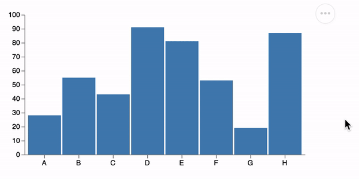

# Vega-Embed

[](https://www.npmjs.com/package/vega-embed)
[](https://www.jsdelivr.com/package/npm/vega-embed)
[](https://travis-ci.org/vega/vega-embed)
[](https://github.com/prettier/prettier) [](https://greenkeeper.io/)

[Vega-Embed](http://github.com/vega/vega-embed) makes it easy to embed interactive [Vega](https://vega.github.io/vega) and [Vega-Lite](https://vega.github.io/vega-lite) views into web pages. With Vega Embed, you can:

- Load Vega/Vega-Lite specs from source text, parsed JSON, or URLs.
- Add action links such as "View Source" and "Open in Vega Editor".
- Includes [Vega Tooltip](https://github.com/vega/vega-tooltip).
- Includes [Vega Themes](https://github.com/vega/vega-themes). **Experimental: themes are not stable yet**

**Vega-Lite works well with [Observable](https://beta.observablehq.com/). Learn how to use it in [our example notebook](https://beta.observablehq.com/@domoritz/hello-vega-embed).**



## Basic Example

You can import Vega-Embed from a local copy or (as shown below) [from jsDelivr](hhttps://www.jsdelivr.com/package/npm/vega-embed). Please replace `[VERSION]` with the correct [Vega](https://www.jsdelivr.com/package/npm/vega), [Vega-Lite](https://www.jsdelivr.com/package/npm/vega-lite), and [Vega-Embed](https://www.jsdelivr.com/package/npm/vega-embed) versions. We recommend that you specify the major versions (`vega@4`, `vega-lite@3`, `vega-embed@3`).

```html
<!DOCTYPE html>
<html>
<head>
  <!-- Import Vega 4 & Vega-Lite 3 (does not have to be from CDN) -->
  <script src="https://cdn.jsdelivr.net/npm/vega@[VERSION]"></script>
  <script src="https://cdn.jsdelivr.net/npm/vega-lite@[VERSION]"></script>
  <!-- Import vega-embed -->
  <script src="https://cdn.jsdelivr.net/npm/vega-embed@[VERSION]"></script>
</head>
<body>

<div id="vis"></div>

<script type="text/javascript">
  var spec = "https://raw.githubusercontent.com/vega/vega/master/docs/examples/bar-chart.vg.json";
  vegaEmbed('#vis', spec).then(function(result) {
    // Access the Vega view instance (https://vega.github.io/vega/docs/api/view/) as result.view
  }).catch(console.error);
</script>
</body>
</html>
```

Look at an example online at [Vega-Embed Block](https://bl.ocks.org/domoritz/455e1c7872c4b38a58b90df0c3d7b1b9).


## API Reference

When using a `script` tag, the default export of Vega-Embed is a wrapper function that automatically chooses between [`embed`](#embed) and [`container`](#container) based on the provided arguments. Vega-Embed provides this convenience for imports in interactive environments like [Observable](https://www.observablehq.com/). When using the Vega-Embed npm package, the default export is the [`embed`](#embed) function.

<a href="#embed" name="embed">#</a>
<b>embed</b>(<i>el</i>, <i>spec</i>[, <i>opt</i>])
[<>](https://github.com/vega/vega-embed/blob/master/src/embed.ts "Source")

Returns a [Promise](https://developer.mozilla.org/en-US/docs/Web/JavaScript/Reference/Global_Objects/Promise) that resolves to the instantiated [Vega `View` instance](https://github.com/vega/vega-view#vega-view) and a copy of the parsed JSON Vega spec. The `embed` function accepts the following arguments:

| Property| Type       | Description    |
| :------ | :--------- | :------------- |
| `el`      |  String  | A DOM element or CSS selector indicating the element on the page in which to add the embedded view. |
| `spec`    | String / Object | _String_ : A URL string from which to load the Vega specification. This URL will be subject to standard browser security restrictions. Typically this URL will point to a file on the same host and port number as the web page itself. <br> _Object_ :  The Vega/Vega-Lite specification as a parsed JSON object. |
| `opt`     | Object   | _(Optional)_ A JavaScript object containing options for embedding. |

_Note: Internet Explorer does not support [the ES6 Promise](https://developer.mozilla.org/en-US/docs/Web/JavaScript/Reference/Global_Objects/Promise) feature. To make it work correctly, please follow [the instructions on the Vega website](https://vega.github.io/vega/usage/#ie)._

<a href="#container" name="container">#</a>
<b>container</b>(<i>spec</i>[, <i>opt</i>])
[<>](https://github.com/vega/vega-embed/blob/master/src/container.ts "Source")

Returns a [Promise](https://developer.mozilla.org/en-US/docs/Web/JavaScript/Reference/Global_Objects/Promise)* that resolves to an HTML element with the [Vega `View` instance](https://github.com/vega/vega-view#vega-view) as the `value` property. The function is designed to work with [Observable](https://observablehq.com/). The `container` function accepts the following arguments:

| Property| Type       | Description    |
| :------ | :--------- | :------------- |
| `spec`    | String / Object | _String_ : A URL string from which to load the Vega specification. This URL will be subject to standard browser security restrictions. Typically this URL will point to a file on the same host and port number as the web page itself. <br> _Object_ :  The Vega/Vega-Lite specification as a parsed JSON object. |
| `opt`     | Object   | _(Optional)_ A JavaScript object containing options for embedding. |

### Options

```js
var opt = {
  "mode": ...,

  "theme": ...,
  "defaultStyle": ...,

  // view config options
  "renderer" : ...,
  "loader" : ...,
  "logLevel" : ...,

  "tooltip": ...,

  "patch" : ...,

  "width" : ...,
  "height" : ...,
  "padding" : ...,

  "actions" : {
    "export": ...,
    "source": ...,
    "compiled": ...,
    "editor": ...
  },

  "scaleFactor": ...,

  "config"  : ...,

  "editorUrl": ...,

  "sourceHeader" : ...,
  "sourceFooter": ...,

  "hover" : {
    hoverSet: ...,
    updateSet: ...,
  },

  "runAsync": ...,

  "i18n": {
    "COMPILED_ACTION": ...,
    "EDITOR_ACTION": ...,
    "PNG_ACTION": ...,
    "SOURCE_ACTION": ...,
    "SVG_ACTION": ...
  }
}
```

| Property | Type             | Description    |
| :------- | :--------------- | :------------- |
| `mode`        | String        | If specified, tells Vega-Embed to parse the spec as `vega` or `vega-lite`. Vega-Embed will parse the [`$schema` url](https://github.com/vega/schema) if the mode is not specified. Vega-Embed will default to `vega` if neither `mode`, nor `$schema` are specified. |
| `theme`       | String        | If specified, tells Vega-Embed use the theme from [Vega Themes](https://github.com/vega/vega-themes). **Experimental: we may update themes with minor version updates of Vega-Embed.** |
| `defaultStyle` | Boolean or String | If set to `true` (default), the embed actions are shown in a menu. Set to `false` to use simple links. Provide a string to set the style sheet. |
| `renderer`    | String        | The renderer to use for the view. One of `"canvas"` (default) or `"svg"`. See [Vega docs](https://vega.github.io/vega/docs/api/view/#view_renderer) for details. |
| `logLevel`    | Level         | Sets the current log level. See [Vega docs](https://vega.github.io/vega/docs/api/view/#view_logLevel) for details. |
| `tooltip`     | Handler or Boolean or Object | Provide a [tooltip handler](https://vega.github.io/vega/docs/api/view/#view_tooltip), customize the default [Vega Tooltip](https://github.com/vega/vega-tooltip) handler, or disable the default handler. |
| `loader`      | Loader / Object | _Loader_ : Sets a custom Vega loader. _Object_ : Vega loader options for a loader that will be created. <br> See [Vega docs](https://vega.github.io/vega/docs/api/view/#view) for details. |
| `patch`       | Function / Object / String | A function to modify the Vega specification before it is parsed. Alternatively, an object that is used to patch the Vega specification. If you use Vega-Lite, the compiled Vega will be patched. Alternatively to the function or the object, a URL string from which to load the patch can be provided. This URL will be subject to standard browser security restrictions. Typically this URL will point to a file on the same host and port number as the web page itself. |
| `width`       | Number        | Sets the view width in pixels. See [Vega docs](https://vega.github.io/vega/docs/api/view/#view_width) for details. Note that Vega-Lite overrides this option. |
| `height`      | Number        | Sets the view height in pixels. See [Vega docs](https://vega.github.io/vega/docs/api/view/#view_height) for details. Note that Vega-Lite overrides this option. |
| `padding`     | Object        | Sets the view padding in pixels. See [Vega docs](https://vega.github.io/vega/docs/api/view/#view_padding) for details. |
| `actions`     | Boolean / Object | Determines if action links ("Export as PNG/SVG", "View Source", "View Vega" (only for Vega-Lite), "Open in Vega Editor") are included with the embedded view. If the value is `true`, all action links will be shown and none if the value is `false`.  This property can take a key-value mapping object that maps keys (`export`, `source`, `compiled`, `editor`) to boolean values for determining if each action link should be shown.  By default, `export`, `source`, and `editor` are true and `compiled` is false. These defaults can be overridden: for example, if `actions` is `{export: false, source: true}`, the embedded visualization will have two links – "View Source" and "Open in Vega Editor".  The `export` property can take a key-value mapping object that maps keys (svg, png) to boolean values for determining if each export action link should be shown. By default, `svg` and `png` are true. |
| `scaleFactor` | Number        | The number by which to multiply the width and height (default `1`) of an exported PNG or SVG image. |
| `config`      | String / Object | _String_ : A URL string from which to load a [Vega](https://vega.github.io/vega/docs/config/)/[Vega-Lite](https://vega.github.io/vega-lite/docs/config.html) or [Vega-Lite](https://vega.github.io/vega-lite/docs/config.html) configuration file. This URL will be subject to standard browser security restrictions. Typically this URL will point to a file on the same host and port number as the web page itself. <br> _Object_ : A Vega/Vega-Lite configuration as a parsed JSON object to override the default configuration options. |
| `editorUrl`    | String   | The URL at which to open embedded Vega specs in a Vega editor. Defaults to `"http://vega.github.io/editor/"`. Internally, Vega-Embed uses [HTML5 postMessage](https://developer.mozilla.org/en-US/docs/Web/API/Window/postMessage) to pass the specification information to the editor. |
| `sourceHeader` | String   | HTML to inject into the `` tag of the page generated by the "View Source" and "View Vega" action link. For example, this can be used to add code for [syntax highlighting](https://highlightjs.org/). |
| `sourceFooter` | String   | HTML to inject into the end of the page generated by the "View Source" and "View Vega" action link. The text will be added immediately before the closing `` tag. |
| `hover`       | Boolean or Object  | Enable [hover event processing](https://vega.github.io/vega/docs/api/view/#view_hover). Hover event processing is enabled on Vega by default.<br> _Boolean_: Enables/disables hover event processing.<br> _Object_: Optional keys (`hoverSet`, `updateSet`) to specify which named encoding sets to invoke upon mouseover and mouseout. |
| `runAsync`     | Boolean  | Use [`runAsync`](https://vega.github.io/vega/docs/api/view/#view_runAsync) instead of [`run`](https://vega.github.io/vega/docs/api/view/#view_run). |
| `i18n`         | Object   | This property maps keys (`COMPILED_ACTION`, `EDITOR_ACTION`, `PNG_ACTION`, `SOURCE_ACTION`, `SVG_ACTION`) to string values for the action's text. By default, the text is in English. |

## Common questions

### How do I send cookies when loading data?

By default, the Vega loader does not send the credentials of the current page with requests. You can override this behavior by passing `{loader: { http: { credentials: 'same-origin' }}}` as the embed option.

## Build Process

To build `vega-embed.js` and view the test examples, you must have [yarn](https://yarnpkg.com/en/) installed.

1. Run `yarn` in the Vega-Embed folder to install dependencies.
2. Run `yarn build`. This will create `vega-embed.js` and the minified `vega-embed.min.js`.
3. Run a local webserver with `yarn start` then point your web browser at the test page (e.g., `http://localhost:8000/test-vg.html`(Vega) or `http://localhost:8000/test-vl.html`(Vega-Lite)).

## Release Process

To release a new version, make sure that everything works. Then run `yarn version` and bump the version number. Lastly, push to GitHub (with the release tag). [Travis](https://travis-ci.org/vega/vega-embed/builds) will build a bundle and make the [npm release](https://www.npmjs.com/package/vega-embed) automatically.
